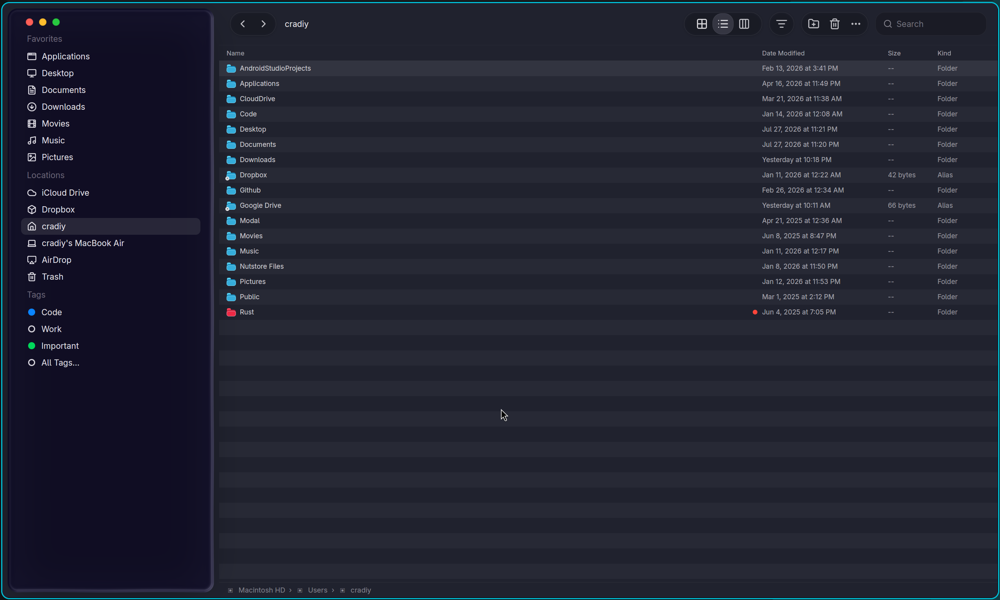
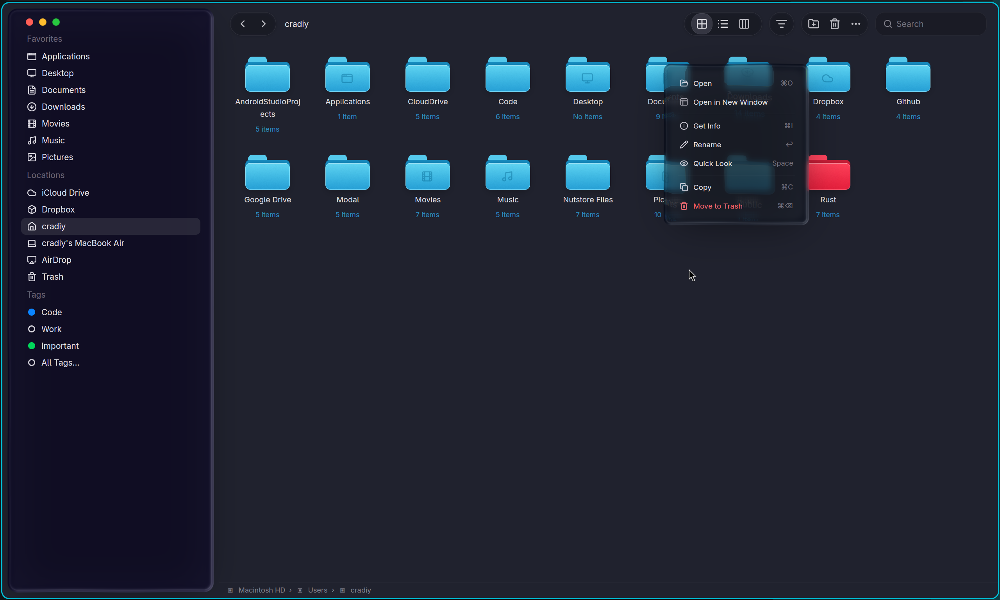

# macOS 26 Finder · Liquid Glass Demo

> This is a demo. Just a demo.

[](https://www.rust-lang.org/)
[](https://github.com/cradiy/gpui)
[](LICENSE)

I did not build this to change the world, replace Finder, or start another file-manager project that somehow needs seventeen years to reach version 1.0.

I built it because I added a liquid-glass effect to [my GPUI fork](https://github.com/cradiy/gpui), and shiny new rendering code deserves something nicer than a rectangle with “Hello, world” in the middle. Finder felt like the perfect excuse to put a lot of glass on the screen, so here we are.

As everyone knows, Rust is the best programming language in the world, so GPUI is obviously the best GUI framework in the world. The logic is flawless. Case closed.



## So, what did I add to GPUI?

The star of the show is `gpui_effects::GlassPanel`, a container that turns whatever is behind it into a dynamic glass material.

It brings together:

- live backdrop sampling and blur;
- refraction and chromatic dispersion;
- configurable tint, optics, edge lighting, and surface response;
- animated waves and pointer-driven pressure;
- translation velocity for glass that stretches and trails while moving;
- `Thin`, `Regular`, and `Thick` material presets;
- a translucent fallback when live backdrop effects are unavailable.

In this demo, the sidebar and context menu are both real `GlassPanel` containers. The folders beneath the menu are not part of a carefully prepared background image—the glass is sampling the rendered scene behind it.



That is basically the whole project: my GPUI fork, some Finder-inspired pixels, and a suspicious amount of time spent tuning purple glass.

## Run it

```bash
cargo run
```

## 中文

这是一个 Demo。

我写它没啥目的，只是因为我在自己维护的 [cradiy/gpui](https://github.com/cradiy/gpui) 里加了液态玻璃效果。新写的渲染代码总得找个比 “Hello, world” 方块更像样的地方展示，而 Finder 看起来特别适合塞满玻璃，于是就有了这个项目。

众所周知，Rust 是世界上最好的编程语言，所以 GPUI 当然也是世界上最好的 GUI 框架。逻辑严密，论证完毕，不接受反驳。

这次加入的 `gpui_effects::GlassPanel` 是一个动态玻璃容器，包含背景采样、模糊、折射、色散、染色、边缘光、动态波纹和指针压力响应，也提供 `Thin`、`Regular`、`Thick` 三种材质预设。当前画面中的侧边栏和右键菜单都直接使用了这个容器。

差不多就是这样：我的 GPUI fork、一套 Finder 风格界面，以及花了不少时间才调顺眼的紫色玻璃。

## License

[MIT](LICENSE), because even purple glass should be easy to borrow.

---

**By the way:** after all that “this is just a demo” talk, I am actually going to build a Linux file manager—and I want to fill it with as many visual effects as I can. Files need managing. The visuals deserve to go all-out too.

**对了：** 虽然这只是个 Demo，但我后面确实准备写一个 Linux 文件管理器，打算把能想到的各种视觉效果都塞进去，不花里胡哨那我魔改gpui的意义何在。
